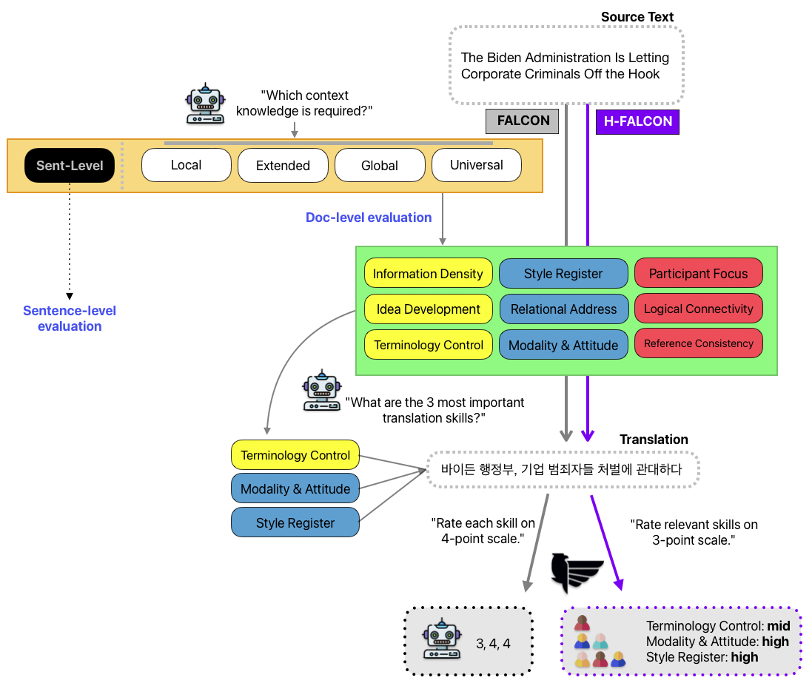

# H-FALCON: Human-centered Functional Assessment of Language and Contextuality in Narratives

This repository contains the data and resources accompanying our paper:
“Context is Ubiquitous, but Rarely Changes Judgments: Revisiting Document-Level MT Evaluation”

📄 Accepted at WMT 2025 (Research Paper) (Preprint is [here](https://www.techrxiv.org/users/915991/articles/1324863-context-is-ubiquitous-but-rarely-changes-judgments-revisiting-document-level-mt-evaluation)).

<figure style="text-align:center;">
  
  <figcaption>
    <b>Figure 1:</b> The evaluation process of FALCON ([Kim, 2025](https://aclanthology.org/2025.acl-industry.12/)), consisting of (1) labeling relevant contextual knowledge and (2) assessing translation skills, followed by (3) rating. In H-FALCON, this dual-phase process is streamlined by simultaneously conducting labeling and rating for all sentences.
  </figcaption>
</figure>


## 🔑 Key Contributions
1.	H-FALCON Protocol: A reproducible document-level human evaluation method for MT aligned with human preferences.
2.	Empirical Findings: Contextual information is universal but exerts limited impact on holistic MT judgments.
3.	Call for Richer Metrics: Moving beyond narrow sentence-bounded metrics toward document-level, pragmatic evaluation    
    
## Abstract

As sentence-level performance in modern Machine Translation (MT) has plateaued, reliable document-level evaluation is increasingly needed. While the recent FALCON framework with pragmatic features offers a promising direction, its reliability and reproducibility are unclear. We address this gap through human evaluation, analyzing sources of low inter-annotator agreement and identifying key factors. Based on these findings,we introduce H-FALCON,a Human-centered refinement of FALCON. Our experiments show that,even with limited annotator consensus, H-FALCON achieves correlations comparable to or better than standard sentence-level protocols. 

Furthermore,we find that contextual information is inherent in all sentences, challenging the view that only some require it. This suggests that prior estimates such as“n% of sentences require context” may stem from methodological artifacts. At the same time,we show that while context is pervasive,not all of it directly influences human judgment.

## Content
- `data/` : Evaluation dataset of WMT24++ (en–ko) ([Deutsch et al.,2025](https://arxiv.org/html/2502.12404v1)).
- `model/` : Model judgments from GPT-4o-mini, o3, and o4-mini.
- `human/` : Human judgments of FALCON and H-FALCON.

# 🚀 Demo
A demo of the H-FALCON human evaluation environment will be released soon. Stay tuned!

# Citation
If you use this repository, please cite our preprint:
```
@inproceedings{kim2025hfalcon,
  title     = {Context is Ubiquitous, but Rarely Changes Judgments: Revisiting Document-Level MT Evaluation},
  author    = {Kim, Ahrii},
  booktitle = {Proceedings of the Conference on Machine Translation (WMT)},
  year      = {2025},
  doi       = {10.36227/techrxiv.175616908.81882817/v1},
}
```

    
# License
The data is licensed under CC BY 4.0.